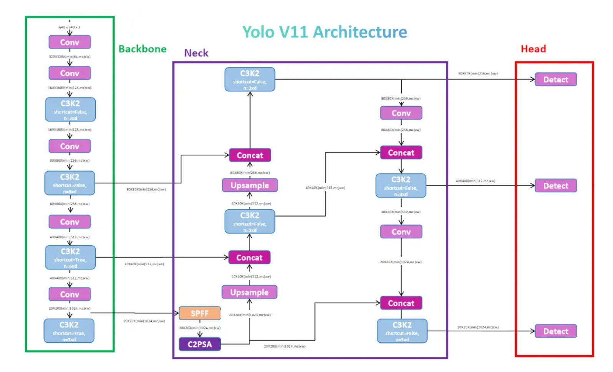

# Distill_hw1
# Анализ модели YOLOv11n

## Предисловие
Инструкция по настройке окружения находится в `setup.md`. 

## 1. Выбор модели и контекст применения

### Описание задачи
**YOLOv11n** (YOLO версии 11, nano-версия) — лёгкая нейросетевая архитектура для детекции объектов в реальном времени. Это одна из самых популярных моделей в задачах видеоаналитики благодаря оптимальному балансу скорости и точности.

Ключевое преимущество — высокая производительность как на CPU, так и на мощных GPU-кластерах. Даже в базовой конфигурации модель демонстрирует впечатляющую скорость инференса:

- ~2 мс на изображение (640×640) при батче=1 на NVIDIA T4 с TensorRT 10 в FP16
- До 500 FPS в оптимизированном окружении

На практике задержка самого инференса часто меньше сетевых задержек при передаче изображений между сервисами. Поэтому стандартный пайплайн ускорения включает:

1. Конвертацию в TensorRT (FP16/INT8)
2. Развёртывание на сервере вывода (Triton Inference Server)
3. End-to-end решения вроде NVIDIA DeepStream для обработки десятков видеопотоков с минимальными задержками

### Платформа

**Видеокарта**: Nvidia 4070 ti 

Объём видеопамяти: 12 ГБ GDDR6X.
Пропускная способность: порядка ~500 ГБ/с
Для сценария real-time допустимые задержки составляют порядка 5 ms, я тестировал на этой видеокарте 
**Важное ограничение:** количество аппаратных кодеков NVENC/NVDEC ограничивает параллельную обработку видеопотоков ([официальные спецификации](https://www.nvidia.com/en-us/geforce/graphics-cards/40-series/rtx-4070-family/)).
Я на практике столкнулся с ограничением в 14 потоков в full hd разрешении.
## 3. Архитектура модели

### Общая структура
YOLOv11n состоит из трёх основных компонентов:

```
Backbone (основной экстрактор признаков)
    ↓
Neck (объединение многомасштабных признаков)
    ↓
Head (предсказание bbox и классов)
```
<div align="center">
  
</div>

### 3.1 Backbone

**Компоненты:**
- **Начальные Conv слои:** Conv(3×3, stride=2) × 2 — уменьшение размера в 4 раза
- **C3k2 блоки:** Улучшенная версия C2f из YOLOv8
  - Использует две параллельные свёртки с kernel size 2
  - Стратегия splitting каналов для параллелизма
### 3.2 Neck (Объединение признаков)

**Компоненты:**
- **SPPF (Spatial Pyramid Pooling - Fast):**
  - Рекурсивный max-pooling (3 итерации)
  - Конкатенация результатов + Conv(1×1)
  - Минимальные FLOPs, многомасштабная информация
- **C2PSA (C2 block + Point-wise Spatial Attention)** 
  - объединение spatial attention с c2 блоком перед пирамидой
- **Результат:** Три уровня многомасштабных признаков для head

### 3.3 Head (Предсказание)

**Структура:**
- **Три параллельные бошки для масштабов:**
  - Small (80×80 × 128) — маленькие объекты
  - Medium (40×40 × 256) — средние объекты
  - Large (20×20 × 512) — большие объекты

- **Для каждого масштаба:**
  - Conv2D слои + BatchNorm + SiLU
  - выдает объединенный тензор из ответов:
    - **Классификации**
    - **bounding box (x,y,w,h)** 
    - **Confidence of object** 

- **Вывод:** Detect layer объединяет предсказания со всех масштабов

### 3.4 Краткая статистика архитектуры
([Информация в ultralytics](https://docs.ultralytics.com/models/yolo11/)).
- **Количество слоёв:** 181 слоёв
- **Параметры:** 2,624,080
- **GFLOPs:** 6.6 B (на 640×640 input)
---

## 4. Вычислительные затраты и узкие места
И
Анализ профилирования (`profiler_torch.txt`) показывает:

- Свёрточные операции (`aten::cudnn_convolution`) потребляют до **3.28 ГБ** памяти
- Время выполнения на 1000 итераций:
  - CPU: 717.25 мс
  - CUDA: 114.95 мс

Это указывает на доминирование накладных расходов PyTorch (перемещение тензоров, управление памятью) над чистыми вычислениями. Подтверждение — в оптимизированном окружении TensorRT задежка снижается до **2.74 мс**, что почти вдвое быстрее, чем в PyTorch.

**Ключевые узкие места:**

1. **Свёрточные слои** — основная вычислительная нагрузка
2. **SPPF-блок** — интенсивная конкатенация признаков разных разрешений
3. **NMS (Non-Maximum Suppression)** — постобработка, не входящая в модель, но занимающая сопоставимое с инференсом время
4. **Softmax** — незначительная доля времени (1.33 мс на CUDA), но потребляет ~327 МБ памяти

## 5. Системные ограничения 
В выбранной конфигурации (YOLOv11n на NVIDIA RTX 4070 Ti) вычислительная часть модели практически не накладывает ограничений: сеть маленькая, занимает порядка ~3 ГБ видеопамяти вместе с фреймворком и служебными буферами (tensorrt-deepstreaam), даёт латентность инференса 3 мс на кадр. Узким местом системы становятся обработка потоков (декодирования)
Для real-time видеоаналитики обычно (batch = 1) требуется:
  - FPS 20
  - Latency of model (preprocessing, inference, postprocessing) 50 ms
  - vram 3 GB

## 6. Гипотезы по ускорению

### **1. Quantization (INT8, FP16)**

**Описание:** Снижение точности весов и activation maps с float32 на int8/fp16

**Затрагиваемые части:**
- Все слои (Conv, FC, attention)
- Backbone, neck, head

**Ускорение & Преимущества:**
- **4× speedup** на GPU с INT8 (TensorRT, CUDA)
- **2× speedup** на GPU с FP16
- **Снижение памяти на 4×** (INT8)
- Практически **нулевая потеря точности** при post-training quantization, то есть с калибровочным датасетом.
-Для fp16 потери точности вовсе нет

**Когда применять:**
- GPU-инференс (TensorRT, ONNX Runtime)
- Edge device
- Когда критична задержка, а модель работает хорошо.

**Когда не применять:**
- Если качество обученной модели итак плохое, то квантизация в int8 сделает только хуже, поэтому базово делают fp16 квантизацию, а int8 уже, когда есть идеальный вариант. В случае с инференсом на видеокартах действительно так.
---

#### **2. Knowledge Distillation *

**Описание:** Обучение меньшей модели на выходах большей модели

**Затрагиваемые части:**
- Вся архитектура (можно сжать backbone)

**Ускорение & Преимущества:**
- **1.5–2× speedup** через сжатие backbone (меньше каналов)
- **Сохранение точности** (даже улучшение на 1–2% mAP)
- Гибкость: можно выбрать степень сжатия

**Когда применять:**
- Когда нужна скорость + и точность и есть время на эксперименты

**Когда не применять:**
- Мало времени и компьюта, любой дистилл требует 2х больше памяти, так как размещается исходная модель и модель ученика.

**Требование:**
- Требует обученную large teacher model (YOLOv11m, YOLOv11l)
- Переобучение может занять десятки часов.


7. Инженерные компромиссы 

Практика работы с семейством YOLO показывает следующий подход:

1. Сначала обучают и тестируют базовую nano-версию (YOLOv11n)
2. Если точности достаточно — останавливаются на ней и применяют FP16-квантизацию
3. При недостаточной точности переходят к более крупным версиям (s → m → l)
4. Для дополнительного ускорения применяют:
   - INT8-квантизацию (быстро, но с небольшой потерей качества)
   - Дистилляцию (сложнее, но может дать лучшее соотношение скорости/точности)

**Ключевой компромисс:** баланс между точностью (mAP) и скоростью (латентность/throughput). В реальных системах также критична стабильность — модели часто «галлюцинируют» на реальных видеопотоках, поэтому финальный выбор архитектуры и оптимизаций делается после тестирования на репрезентативных данных.

**Итоговые рекомендации:**

- Для большинства real-time сценариев достаточно YOLOv11n + FP16
- INT8 даёт до 4× ускорения ценой ~5% mAP
- Дистилляция эффективна при наличии ресурсов на обучение и требовании максимального качества при ограниченной задержке

